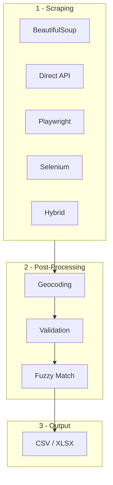

# India Branch Data Pipeline

[](https://python.org)
[](https://docs.astral.sh/uv/)
[](https://www.crummy.com/software/BeautifulSoup/)
[](https://playwright.dev/python/)
[](https://selenium.dev)
[](https://pandas.pydata.org)
[](https://developers.google.com/maps)
[](https://docs.python-requests.org)
[](LICENSE)

A collection of **90+ web scrapers** for Indian bank and NBFC branch data, covering **15,000+ branches** across every Indian state. This repo showcases 13 curated scraping examples organized by technique, plus a complete post-processing pipeline for geocoding, validation, and deduplication.

Built for real-world use: these scrapers feed branch data into Salesforce CRM for financial institution branch network management.

---

## Architecture



---

## Scraping Methods at a Glance

| # | Method | Speed | Complexity | Example Banks | Key Technique |
|---|--------|-------|-----------|---------------|---------------|
| 1 | [BeautifulSoup](examples/method_1_beautifulsoup/) | Fast | Low | CSL Finance, Nido, Shubham | HTML parsing, regex, embedded JSON |
| 2 | [Direct API](examples/method_2_direct_api/) | Fast | Medium | APAC, ICICI HFC, IndusInd | XHR replication, JSON endpoints |
| 3 | [Playwright](examples/method_3_playwright/) | Medium | Medium | Shivalik, Protium | Headless browser, JS rendering |
| 4 | [Selenium](examples/method_4_selenium/) | Slow | High | ART Housing, Saraswat, TVS Credit | CDP logging, cascading dropdowns |
| 5 | [Hybrid](examples/method_5_hybrid/) | Varies | High | Aavas, SK Finance | Session mgmt, custom JSON parsing |

---

## 13 Curated Examples

Each example includes: Python script(s) + CSV data + XLSX data + README.

| # | Bank | Method | What It Demonstrates |
|---|------|--------|---------------------|
| 1 | [CSL Finance](examples/method_1_beautifulsoup/csl_finance/) | BeautifulSoup | CSS-class targeting, coordinate extraction from hrefs |
| 2 | [Nido/Edelweiss](examples/method_1_beautifulsoup/nido_edelweiss/) | BeautifulSoup | State detection regex, concise 60-line parser |
| 3 | [Shubham Housing](examples/method_1_beautifulsoup/shubham_housing/) | BeautifulSoup | JSON embedded in Next.js `<script>` tags |
| 4 | [APAC Finance](examples/method_2_direct_api/apac_finance/) | Direct API | Two-tier API: states → branches → details |
| 5 | [ICICI HFC](examples/method_2_direct_api/icici_hfc/) | Direct API | API with predefined city/state parameter list |
| 6 | [IndusInd Bank](examples/method_2_direct_api/indusind_bank/) | Direct API | Simplest: one JSON dump → one parser script |
| 7 | [Shivalik Bank](examples/method_3_playwright/shivalik_bank/) | Playwright | Both Playwright AND requests versions |
| 8 | [Protium](examples/method_3_playwright/protium/) | Playwright | Browser scraper + CSV post-processing |
| 9 | [ART Housing](examples/method_4_selenium/art_housing/) | Selenium | CDP performance logging + AJAX capture |
| 10 | [Saraswat Bank](examples/method_4_selenium/saraswat_bank/) | Selenium | Triple-nested dropdown, 4 fallback methods |
| 11 | [TVS Credit](examples/method_4_selenium/tvs_credit/) | Selenium | Iterative evolution: v1 → v2 → v3 → API |
| 12 | [Aavas](examples/method_5_hybrid/aavas/) | Hybrid | AJAX + session cookies + CSRF tokens |
| 13 | [SK Finance](examples/method_5_hybrid/sk_finance/) | Hybrid | Bracket-depth JSON from Next.js payload |

---

## Quick Start

### Prerequisites
- Python 3.9+
- [uv](https://docs.astral.sh/uv/) (recommended) or pip

### Installation

#### Option A: Using uv (recommended)

[uv](https://docs.astral.sh/uv/) is an extremely fast Python package manager written in Rust. It handles virtual environments and dependency resolution automatically.

```bash
# Install uv (if not already installed)
curl -LsSf https://astral.sh/uv/install.sh | sh

# Clone and set up
git clone https://github.com/yourusername/india-branch-data-pipeline.git
cd india-branch-data-pipeline

# Create venv + install all dependencies in one step
uv sync

# Or if you prefer to install from requirements.txt
uv pip install -r requirements.txt
```

#### Option B: Using pip

```bash
git clone https://github.com/yourusername/india-branch-data-pipeline.git
cd india-branch-data-pipeline
python -m venv .venv && source .venv/bin/activate
pip install -r requirements.txt
```

#### Additional Setup

For Playwright examples:
```bash
# With uv
uv run playwright install chromium

# With pip
python -m playwright install chromium
```

For geocoding (optional):
```bash
cp .env.example .env
# Edit .env and add your Google Maps API key
```

### Run an Example

```bash
# Simplest example: IndusInd Bank (Direct API)
cd examples/method_2_direct_api/indusind_bank
python extract_indusind_data.py

# BeautifulSoup example: CSL Finance
cd examples/method_1_beautifulsoup/csl_finance
python extract_csl_data.py
```

### Run Pipeline Utilities

```bash
# Extract coordinates from Google Maps URLs
cd pipeline/geocoding
python coordinate_extractor.py

# Geocode addresses via Google API (requires API key)
python address_geocoder.py

# Find duplicates between datasets
cd pipeline/validation
python find_duplicates.py
```

---

## Project Structure

```
india-branch-data-pipeline/
├── README.md
├── LICENSE                          # MIT
├── requirements.txt
├── .gitignore
├── .env.example                     # Template for API keys
│
├── docs/
│   ├── SCRAPING_METHOD_GALLERY.md   # All 5 methods explained
│   ├── COORDINATE_EXTRACTION_GUIDE.md  # 3 approaches for lat/lng
│   ├── DATA_PIPELINE_OVERVIEW.md    # Full pipeline walkthrough
│   └── DECISION_FLOWCHART.md        # "Which method?" guide
│
├── examples/
│   ├── method_1_beautifulsoup/      # 3 examples
│   ├── method_2_direct_api/         # 3 examples
│   ├── method_3_playwright/         # 2 examples
│   ├── method_4_selenium/           # 3 examples
│   └── method_5_hybrid/             # 2 examples
│
└── pipeline/
    ├── README.md
    ├── geocoding/                   # URL expansion + API geocoding
    ├── validation/                  # Dedup + comparison + fuzzy match
    └── samples/                     # Test CSV files
```

---

## Tech Stack

| Category | Tools |
|----------|-------|
| **Language** |  |
| **Package Manager** |   |
| **HTTP** |   |
| **HTML Parsing** |   |
| **Browser Automation** |   |
| **Data Processing** |   |
| **Geocoding** |  |
| **Fuzzy Matching** |   |

---

## Documentation

| Document | Description |
|----------|-------------|
| [Scraping Method Gallery](docs/SCRAPING_METHOD_GALLERY.md) | Deep dive into all 5 scraping methods with comparison matrix |
| [Coordinate Extraction Guide](docs/COORDINATE_EXTRACTION_GUIDE.md) | 3 techniques for extracting lat/lng from Google Maps URLs |
| [Data Pipeline Overview](docs/DATA_PIPELINE_OVERVIEW.md) | End-to-end walkthrough: scrape → geocode → validate → export |
| [Decision Flowchart](docs/DECISION_FLOWCHART.md) | Interactive guide: which method to use for a given website |
| [Pipeline README](pipeline/README.md) | Post-processing tools documentation |

---

## Data Scale

- **90+ institutions** scraped (banks, NBFCs, housing finance companies)
- **15,000+ branch records** with addresses across all Indian states
- **5 scraping methods** adapted per institution's website architecture
- **13 curated examples** selected to cover diverse techniques and difficulty levels

---
## Author : Rajdeep
## License

MIT License. See [LICENSE](LICENSE) for details.
